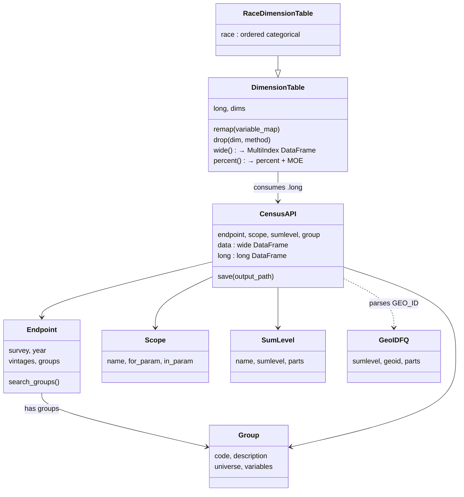
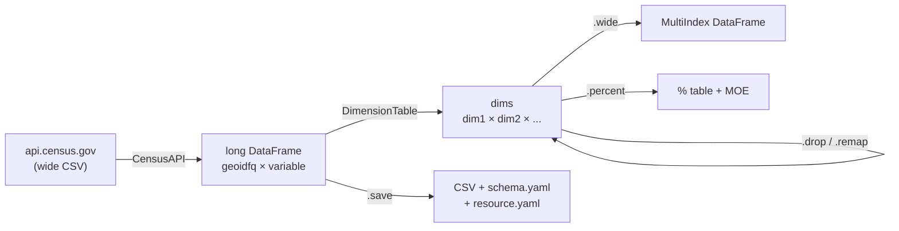

# morpc-census — Architecture Snapshot

## Modules

```
morpc_census/
├── api.py        # Census API client + data transformation  (Endpoint, Group, CensusAPI, DimensionTable)
├── geos.py       # Geography query construction + GEOID parsing  (Scope, SumLevel, GeoIDFQ)
├── tigerweb.py   # TIGERweb geometry fetching
└── constants.py  # Domain lookup tables — AGEGROUP_MAP, RACE_TABLE_MAP, etc.  (pure data, no I/O)
```

---

## Class Relationships



---

## Data Flow



---

## Census API Calls

**Base URL:** `https://api.census.gov/data`

| When | Endpoint called |
|------|----------------|
| `Endpoint(survey, year)` | `GET /data/` — list available datasets & vintages |
| `Group(endpoint, code)` | `GET /data/{year}/{survey}/groups/{code}.json` — variable labels & universe |
| `CensusAPI(...)` | `GET /data/{year}/{survey}?get=group(B01001)&for=county:*&in=state:39` |
| `geoinfo_from_scope_sumlevel(...)` | `GET /data/{year}/geoinfo?get=GEO_ID,NAME&for=tract:*&ucgid=pseudo(...)` |
| `fetch_geos_from_scope_sumlevel(...)` | `GET tigerweb.geo.census.gov/.../MapServer/{layer}/query` — geometries |

**Key query params:** `get`, `for`, `in`, `ucgid=pseudo(parent$child)`, `key`  
**Variable suffixes:** `E` estimate · `M` MOE · `PE` percent estimate · `PM` percent MOE

---

## Notes

- **No network calls on import** — `SCOPES`, `Endpoint.groups`, and `Group.variables` are lazy-cached on first access.
- **Long-format model** — all data is melted to one row per geography × variable before any transformation.
- **MOE propagation** — aggregation uses `sqrt(sum(moe²))`; percentages use the Census Bureau derived proportion formula.
- **Variable batching** — individual variable fetches are chunked at 48 per request (Census API limit is 50).
- **Outputs** — `CensusAPI.save()` writes `.csv` + `schema.yaml` + `resource.yaml` (frictionless descriptors).
