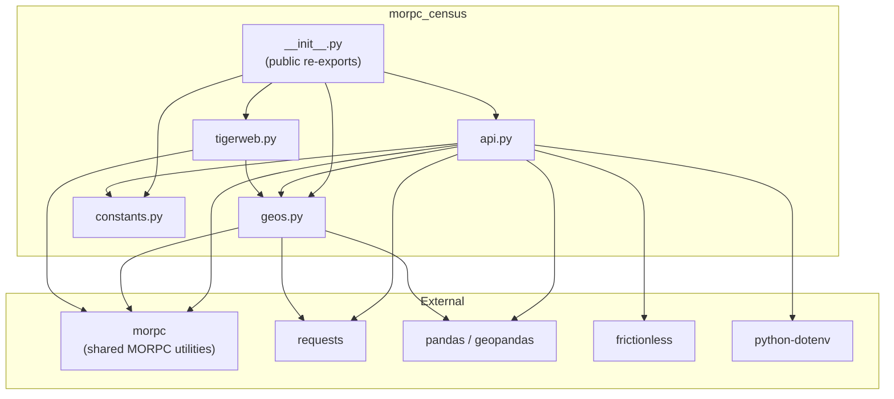
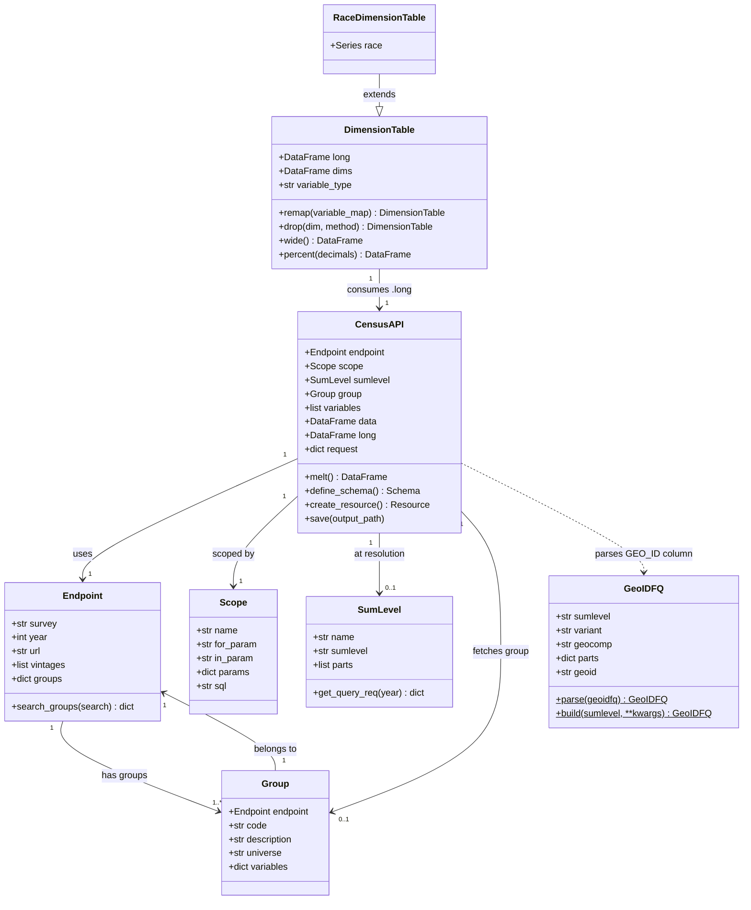
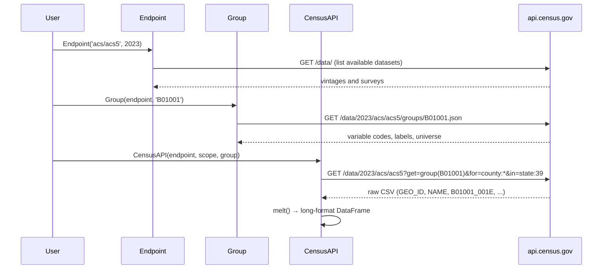
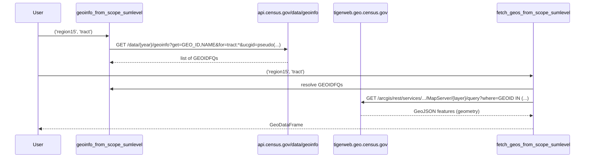
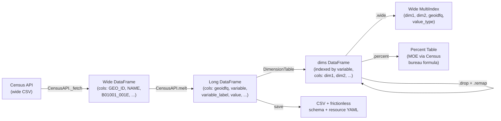

# morpc-census — Architecture Overview

## Package Layout

```
morpc_census/
├── __init__.py      # Public API re-exports
├── api.py           # Census API client + data transformation
├── geos.py          # Geography query construction + GEOID parsing
├── constants.py     # Domain lookup tables (pure data, no I/O)
└── tigerweb.py      # TIGERweb geometry fetching
```

---

## Module Dependency Graph



---

## Core Classes



---

## Census API Call Flow

All network calls go to one base URL: **`https://api.census.gov/data`**



### Census API Query Parameters

| Parameter | Purpose | Example |
|-----------|---------|---------|
| `get` | Variable group or list | `group(B01001)` or `B01001_001E,B01001_002E` |
| `for` | Geographic unit | `county:049`, `tract:*`, `us:1` |
| `in` | Parent geography filter | `state:39` |
| `ucgid` | Hierarchical pseudo-query | `pseudo(050000US39049$0500000)` |
| `key` | Optional API key | from `CENSUS_API_KEY` env var |

> **Variable suffix codes:** `E` = estimate · `M` = margin of error · `PE` = percent estimate · `PM` = percent MOE · `N` = total

---

## Geography API Call Flow



---

## Data Transformation Pipeline



---

## Implemented Survey Endpoints

| Survey | Type | Notes |
|--------|------|-------|
| `acs/acs1` | American Community Survey 1-year | Annual estimates |
| `acs/acs1/profile` | ACS 1-year profile tables | DP-prefixed groups |
| `acs/acs1/subject` | ACS 1-year subject tables | S-prefixed groups |
| `acs/acs5` | American Community Survey 5-year | Most commonly used |
| `acs/acs5/profile` | ACS 5-year profile tables | |
| `acs/acs5/subject` | ACS 5-year subject tables | |
| `dec/pl` | Decennial — Public Law redistricting | 2010, 2020 |
| `dec/dhc` | Decennial — Demographic & Housing Chars | 2020 |
| `dec/ddhca` / `dec/ddhcb` | Detailed DHC variants | 2020 |
| `dec/sf1` / `sf2` / `sf3` | Decennial Summary Files | Historical |
| `geoinfo` | Geographic metadata | Used internally |

---

## Key Design Decisions

**Lazy network access** — `import morpc_census` makes no network calls. `SCOPES`, `Endpoint.groups`, and `Group.variables` are all cached on first access.

**Long-format data model** — Census data arrives wide (variables as columns). `CensusAPI.melt()` immediately converts to long format (one row per geography × variable), which makes multi-group concatenation and `DimensionTable` operations straightforward.

**Dimension parsing** — Census variable labels use `!!`-delimited hierarchies (e.g., `Total:!!Male:!!Under 5 years`). `DimensionTable._parse_dims()` splits these into named columns, enabling `drop()` and `remap()` operations with correct MOE propagation (`sqrt(sum(moe²))`).

**Batched variable fetches** — When fetching individual variables (not a full group), the Census API caps at 50 fields per request. `CensusAPI._fetch_variables()` batches in chunks of 48, then concatenates.

**Pseudo-geography queries** — Multi-county regions use the Census API's `ucgid=pseudo(parent$child)` predicate to avoid fetching all state geographies and filtering. Falls back to hierarchical for/in queries when `pseudo()` is unsupported.

**Frictionless metadata** — `CensusAPI.save()` writes three files: `.csv` (data), `schema.yaml` (field types and labels), and `resource.yaml` (title, sources, schema pointer).

---

## Environment Configuration

```
CENSUS_API_KEY    # Optional; raises rate limits on api.census.gov
                  # Loaded from shell environment or .env file
```

---

## Quick Reference: Entry Points

```python
from morpc_census import (
    # Discovery
    Endpoint, Group,

    # Data fetching
    CensusAPI,

    # Data transformation
    DimensionTable, RaceDimensionTable,

    # Geography
    Scope, SCOPES, SumLevel, GeoIDFQ,
    geoinfo_from_scope_sumlevel,
    fetch_geos_from_scope_sumlevel,

    # Domain constants
    AGEGROUP_MAP, RACE_TABLE_MAP, EDUCATION_ATTAIN_MAP,
    INCOME_TO_POVERTY_MAP,
)
```

```python
# Minimal fetch: ACS 5-year poverty data for MORPC 15-county region
ep  = Endpoint('acs/acs5', 2023)
grp = Group(ep, 'B17001')
api = CensusAPI(ep, SCOPES['region15'], group=grp, sumlevel=SumLevel('county'))

table = DimensionTable(api.long)
wide  = table.wide()      # MultiIndex DataFrame
pct   = table.percent()   # Percentage table with MOE
```
